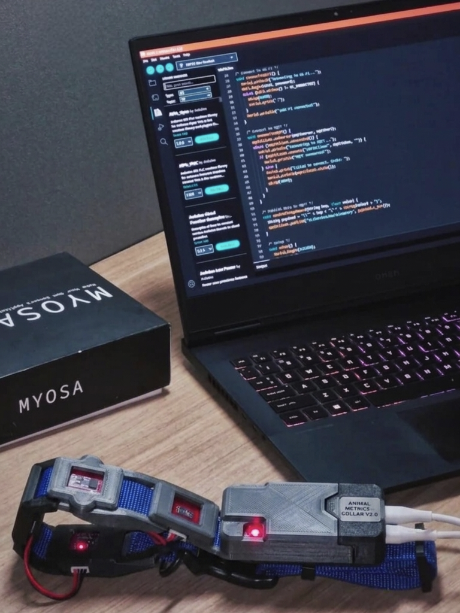
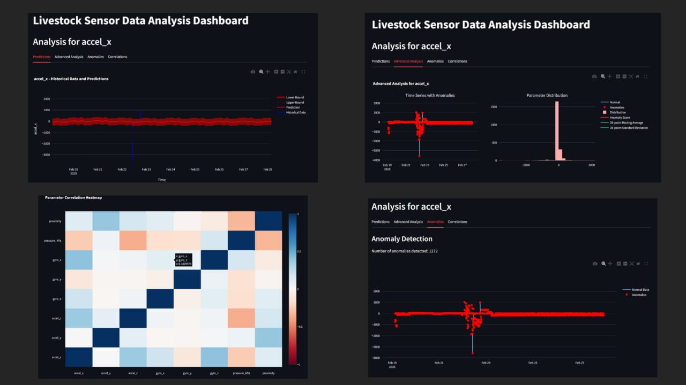
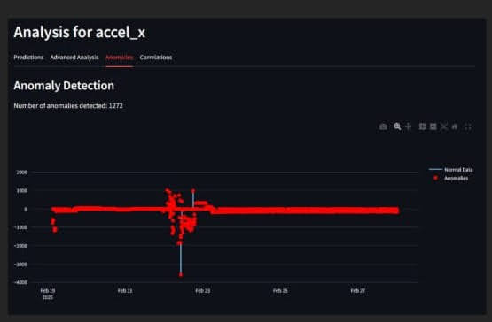
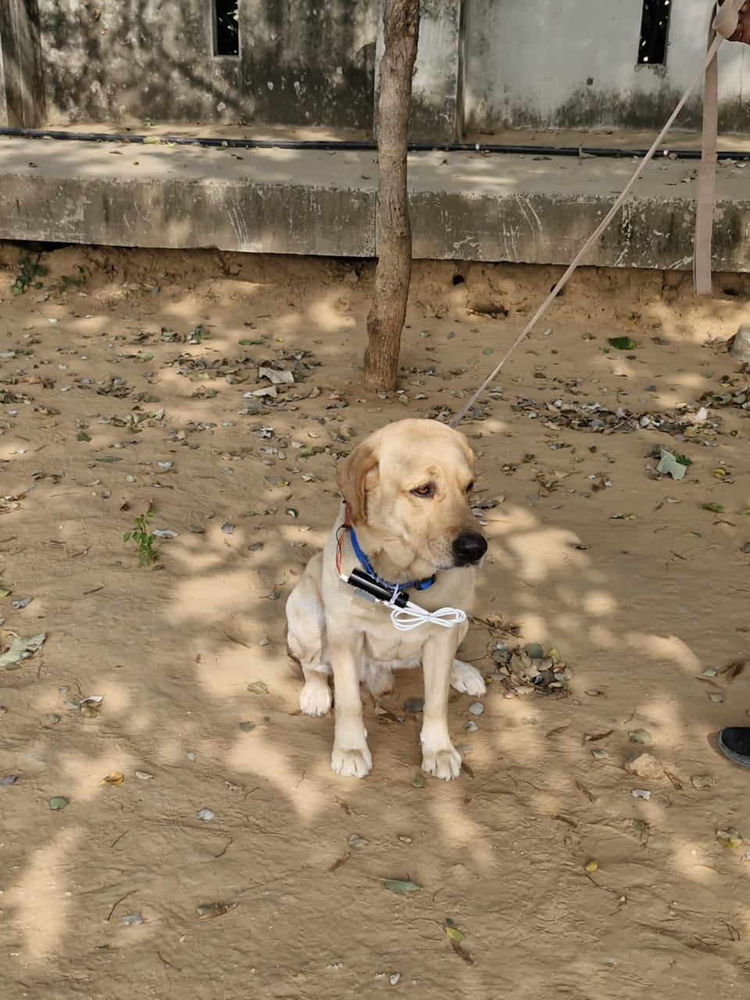
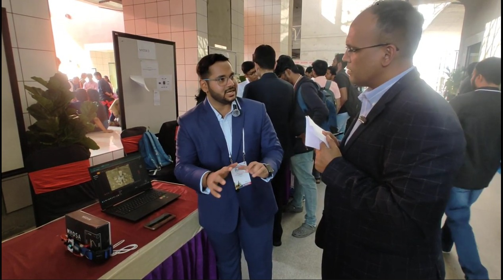
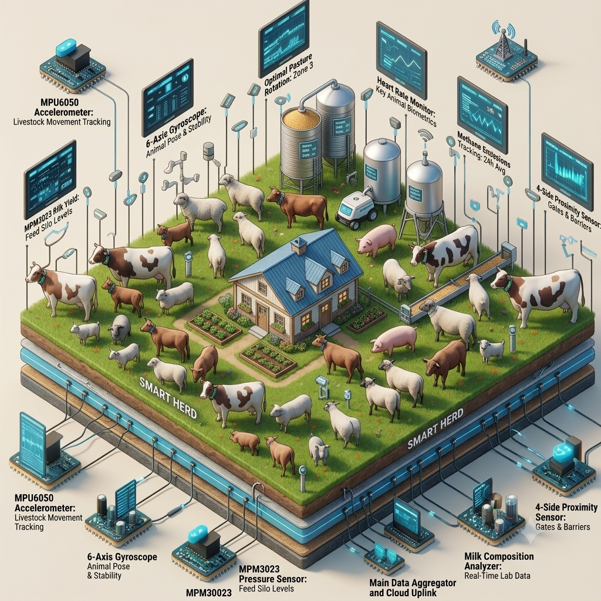

<h1 align="center">Smart Herd: Revolutionizing Livestock Monitoring with MYOSA</h1>

<p align="center">
  
</p>

<p align="center">
  <i>A MYOSA-powered smart collar that turns a herd's movement, behaviour, and environment into insights a farmer can act on before it's too late.</i>
</p>

---

## Acknowledgements

Smart Herd is built on the **MYOSA** ("Make Your Own Sensor Application") board and owes a lot to the **MYOSA Sensors Council** for the platform, the mentorship, and this opportunity to compete at **IEEE YESIST12 2026**.

Since our last submission, we've also been fortunate enough to validate the platform in a second real-world setting, through a collaboration with **Rashtriya Raksha University (RRU)**, under the guidance of our mentor and faculty there. That work, and everything we learned from it, is what our advancements section below is all about.

---

## Overview

Small-scale livestock farming still runs on manual observation. A farmer walks the herd, watches for limping, lethargy, or off behaviour, and hopes to catch a problem before it becomes serious. It's labour-intensive, it's inconsistent, and by the time a health issue is visible to the naked eye, it's often already advanced. India's livestock-monitoring technology market is projected to reach **$1.65 billion by 2027**, yet the smart solutions available today are built for large commercial farms and priced well out of reach for the average small-scale farmer.

**Smart Herd** exists to close that gap. It's a lightweight, MYOSA-based smart belt/collar that a farmer can strap onto an animal in minutes. From there, it continuously tracks movement, behaviour, and environmental conditions, and streams that data to a simple, farmer-friendly dashboard, with AI-driven alerts that flag potential health issues before they turn into emergencies.

**Who it's for:** small and mid-scale livestock farmers who need affordable, continuous monitoring without hiring extra hands or learning complex software.

**What problem it solves:** it turns herd health monitoring from a manual, reactive routine into something passive and proactive, catching the early signs of illness, stress, or injury that a busy farmer might otherwise miss.

**Key features:**
* A wearable smart belt built around the MYOSA sensor board, with no bulky or invasive hardware
* Continuous tracking of movement, behaviour, and environmental conditions
* A live, easy-to-read dashboard designed for non-technical users
* AI-driven early-warning alerts for potential health issues
* Designed for affordability: ₹2,999 for the hardware, plus a ₹59/month (or ₹699/year) software subscription
* Developed in collaboration with academic partners to keep the science behind the alerts rigorous

---

## Advancements & Improvements for YESIST12 2026

*This is an upgraded version of our previous MYOSA-based Smart Herd submission. Here's the dedicated breakdown of everything that's new since then.*

Since our last round, we didn't just refine Smart Herd for farms. We also put the exact same sensor platform through a much tougher, entirely different real-world test, and came back with a stronger, more capable product for it. Here's what changed:

1. **Proved the platform generalizes beyond cattle.** In partnership with the **Rashtriya Raksha University Sensors Council**, we adapted the Smart Herd hardware into a collar for monitoring working animals in a defense-research setting. It's the same MYOSA sensor core and the same telemetry pipeline, just deployed on a completely different animal in a completely different environment, and it held up. That's strong evidence the platform is a genuinely general-purpose animal-monitoring system, not a one-species product.
2. **Added cloud connectivity alongside BLE.** The original design relied on Bluetooth pairing with a nearby phone. The collar firmware now also pushes live sensor data to **ThingsBoard Cloud** over Wi-Fi/MQTT, so a farm manager (or, in the RRU pilot, a base station) can monitor multiple animals remotely, not just whoever happens to be standing next to the animal.
3. **Built a real machine-learning layer.** Our dashboard used to just show live readings. It now runs **Prophet-based time-series forecasting** to project where a parameter like temperature or activity is heading, and an **Isolation Forest** anomaly-detection model to flag readings that don't fit the animal's normal pattern. On top of that, correlation heatmaps help spot compound issues, like unusual motion *and* rising temperature happening at the same time. All of it is wrapped in an interactive **Streamlit** dashboard.
4. **Introduced a rule-based alert engine.** On top of the ML layer, we now trigger specific, actionable alerts for prolonged inactivity, overheating (high motion plus high temperature), unexpected proximity events, and environmental anomalies. These are the kind of clear signals a busy farmer or handler can act on immediately, without needing to interpret a chart.
5. **Ran a real, multi-day field trial.** The upgraded collar was worn continuously for **7 days** during the RRU pilot, recording motion, proximity, and temperature data and confirming stable real-time communication with the dashboard the whole time. It was our first sustained field validation, not just a bench test.
6. **Got external validation.** The upgraded system was showcased at **IEEE APSCON 2025 (IIT Hyderabad)** and demonstrated live to the **Honorable Governor of Tamil Nadu** during a visit to Rashtriya Raksha University. That kind of outside scrutiny pushed us to tighten the product before bringing it back to the farm use case.
7. **Turned field feedback into a hardware roadmap.** The trial surfaced concrete, testable feedback around collar comfort and weight. We're now using that directly to refine the physical collar design, with lighter materials, a better strap, and a more compact sensor housing, before our next round of farm pilots.

---

## Demo / Examples

### Images

<p align="center">
  <br/>
  <i>The full Smart Herd kit: the MYOSA motherboard, sensor stack mounted on the collar strap, and the live dashboard open on a laptop, showing real-time temperature and motion readings.</i>
</p>

<p align="center">
  <br/>
  <i>A team member demonstrating the live Smart Herd dashboard: temperature, sensor status, and a live plot of collar orientation.</i>
</p>

<p align="center">
  <br/>
  <i>A closer look at the same dashboard session, showing the sensor readout panels in more detail.</i>
</p>

<p align="center">
  <br/>
  <i>The collar prototype worn by an animal during our 7-day field validation trial, run in partnership with Rashtriya Raksha University.</i>
</p>

<p align="center">
  <br/>
  <i>Close-up of the assembled collar prototype (sensor PCBs on the strap) and the MYOSA kit, presented during the Tamil Nadu Governor's visit to RRU.</i>
</p>

<p align="center">
  <br/>
  <i>Our team presenting Smart Herd's expanded animal-monitoring capability to visiting faculty and officials at Rashtriya Raksha University, following its showcase at IEEE APSCON 2025, IIT Hyderabad.</i>
</p>

<p align="center">
  <br/>
  <i>Our original concept visualization for Smart Herd's farm deployment: a connected herd, with each animal wearing a MYOSA-based sensor belt.</i>
</p>

---

## Features (Detailed)

### 1. Multi-Sensor Health & Motion Telemetry
The collar node is built around the **MYOSA** sensor board, carrying three sensors: the **MPU6050** (6-axis accelerometer and gyroscope) for movement and orientation, the **BMP180** for barometric pressure, altitude, and temperature, and the **APDS9960** for ambient light, proximity, gesture, and colour sensing (used as a proxy for behaviour cues). The firmware cycles through all three roughly every 2 seconds and pushes each reading out over both BLE and MQTT in the same loop.

### 2. Real-Time Farmer Dashboard
A live, uncluttered dashboard shows current readings (temperature, motion, orientation) alongside historical trends, so a farmer can tell at a glance whether an animal's state looks normal or is drifting from its baseline, without needing to read raw sensor data.

### 3. Cloud + BLE Dual Connectivity
The firmware connects to Wi-Fi and publishes telemetry to **ThingsBoard Cloud** over MQTT for remote monitoring, while also sending the same data over **BLE** to a nearby paired device. That way, the system keeps working even without internet access out in the field.

### 4. ML-Driven Anomaly Detection & Forecasting
Historical sensor logs are modelled with **Facebook Prophet** to forecast each parameter with daily and weekly seasonality plus confidence intervals, while an **Isolation Forest** model flags statistically abnormal readings in real time. A correlation heatmap across parameters helps catch compound issues that a single-metric alert would miss.

### 5. Rule-Based Alert Engine
On top of the ML layer, four concrete alert types are built in:
- **Idle alert:** prolonged inactivity that could indicate injury or illness
- **Overheating alert:** high motion combined with elevated temperature
- **Proximity alert:** unexpected presence or contact detected via proximity sensing
- **Environmental alert:** abnormal pressure or temperature patterns

### 6. Rugged, Rechargeable, Modular Design
The electronics sit on a washable strap with a rechargeable battery and modular sensor headers, so parts can be swapped or upgraded without redesigning the whole collar. It's built to survive outdoor, all-weather use, not just a lab bench.

---

## Usage Instructions

**1. Flash the firmware onto the MYOSA (ESP32) board:**

```plaintext
1. Open the collar firmware sketch in the Arduino IDE
2. Install the MYOSA board library plus the WiFi, PubSubClient, and Wire libraries
3. Set your Wi-Fi credentials and ThingsBoard MQTT token in the sketch:
   const char* ssid = "YOUR_WIFI_SSID";
   const char* password = "YOUR_WIFI_PASSWORD";
   const char* mqttToken = "YOUR_THINGSBOARD_DEVICE_TOKEN";
4. Select the correct ESP32 board and COM port, then upload
```

**2. Verify live telemetry:**

```plaintext
Open the Serial Monitor at 115200 baud to confirm the Wi-Fi and MQTT connection,
then check the ThingsBoard Cloud device dashboard for incoming accel_x,
gyro_x, temperature_C, pressure_kPa, ambient_light, and proximity values.
```

**3. Run the local analytics dashboard:**

```bash
cd ml-dashboard
pip install -r requirements.txt
python prediction.py
```

This loads the sensor dataset, fits Prophet models per parameter, and launches the extended Streamlit dashboard (anomaly detection, correlation heatmap, forecasts) in your browser.

**4. Pair via BLE (offline mode):** open the companion Android app, scan for the collar's BLE advertisement, and connect to view live readings with no Wi-Fi or cloud dependency at all. Handy out on a farm where connectivity is unreliable.

---

## Tech Stack

* **Hardware:** MYOSA main board (ESP32-based, Wi-Fi + BLE), MPU6050 (accel/gyro), BMP180 (pressure/temperature), APDS9960 (light/proximity/gesture), 0.96" OLED display, rechargeable Li-ion battery, rugged collar strap
* **Firmware:** C++ / Arduino framework, MYOSA library, `WiFi.h`, `PubSubClient` (MQTT), `Wire.h` (I2C)
* **Cloud / Telemetry:** ThingsBoard Cloud (MQTT broker + device telemetry dashboard)
* **Mobile App:** Android (Kotlin/Java, Gradle), a BLE companion app for offline pairing
* **Data & ML:** Python, pandas, NumPy, Prophet (time-series forecasting), scikit-learn (Isolation Forest, StandardScaler/MinMaxScaler), SciPy, Seaborn, Matplotlib
* **Analytics Dashboard:** Streamlit, Plotly (interactive time-series, anomaly, and correlation visualizations)
* **Data Handling:** Excel/CSV time-series logs (openpyxl), local BLE cache for offline storage

---

## Requirements / Installation

**Firmware (Arduino IDE):**
```plaintext
Board: ESP32 Dev Module
Libraries: MYOSA, WiFi, PubSubClient, Wire
```

**ML Dashboard (Python 3.10+):**
```bash
pip install pandas numpy prophet scikit-learn scipy seaborn matplotlib plotly streamlit openpyxl
```
Full pinned versions are listed in `requirements.txt` inside `ml-dashboard/`.

**Android App:**
```plaintext
Android Studio, Gradle (wrapper included in the app project)
Minimum SDK: as configured in app/build.gradle
```

---

## File Structure (Optional)

The repo is split into a handful of self-explanatory folders: this blog and its images, the collar firmware, the analytics dashboard, and the raw configs and reference docs behind them.

```
MYOSA 2026/
├─ blog-submission/
│  ├─ smart-herd-myosa-blog.md
│  ├─ smart-herd-cover.jpeg
│  ├─ dashboard-live-demo.jpeg
│  ├─ dashboard-live-demo-2.jpeg
│  ├─ prototype-field-trial.jpg
│  ├─ governor-visit-closeup.jpg
│  ├─ ieee-apscon-showcase.jpeg
│  └─ smart-herd-concept.png
├─ firmware/
│  ├─ MYOSA/
│  └─ libraries/
├─ ml-dashboard/
├─ dashboard-configs/
└─ reference-materials/
```

- **blog-submission/** is this write-up and every image used in it
- **firmware/** holds the collar's Arduino sketch and the MYOSA sensor libraries it depends on
- **ml-dashboard/** is the Python side: `prediction.py`, `extended_analysis.py`, the sensor dataset, and `requirements.txt`
- **dashboard-configs/** has the exported dashboard panels and attribute-card definitions
- **reference-materials/** keeps the pitch script, hardware guide, and library docs we built this from

---

## License (Optional)

This project is developed under the MYOSA Sensors Council for academic, research, and IEEE YESIST12 evaluation purposes. Please contact the team before reusing the hardware designs, firmware, or dataset for other purposes.

---

## Contribution Notes (Optional)

We welcome feedback from farmers, veterinary researchers, and embedded/ML engineers alike. Reach out to the team or the MYOSA Sensors Council for collaboration, pilot testing, or firmware and dashboard contributions.
